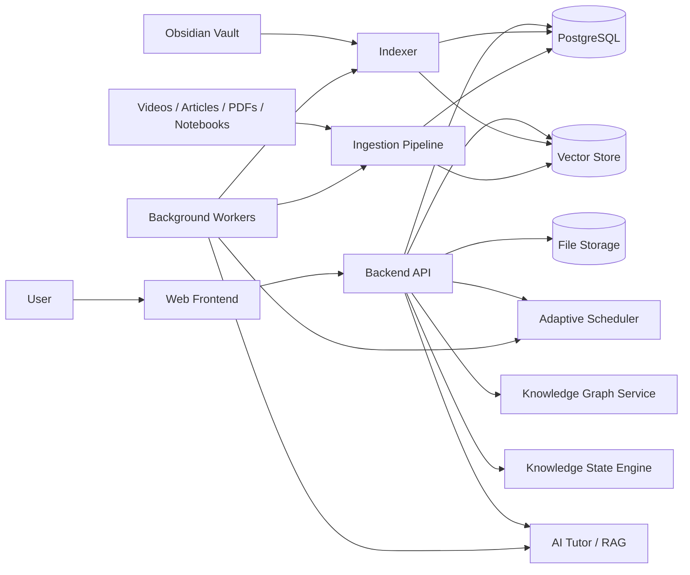

# Personal Learning OS

> Личная self-hosted система глубокого обучения, которая объединяет материалы, Obsidian-заметки, концепции, практику, повторение, адаптивный календарь и диалог с AI-наставником.
>
> Центральный объект системы — не файл и не конспект, а **динамическое состояние понимания конкретной концепции пользователем**.

---

## 1. Назначение документа

Документ описывает продуктовое видение, цели, задачи, пользовательские сценарии, функциональные требования, архитектуру, модель данных, этапы разработки и направления ML-развития сервиса **Personal Learning OS**.

Он должен использоваться как:

- основа для проектирования MVP;
- исходный продуктовый документ;
- ориентир при выборе архитектуры;
- источник задач для backlog;
- критерий оценки новых функций;
- описание долгосрочного направления проекта.

Сервис создаётся прежде всего как личный инструмент, который можно поднять на собственном сервере и использовать для изучения линейной алгебры, NLP, машинного обучения, программирования, математики и других сложных областей.

---

# 2. Видение продукта

## 2.1. Проблема

Большинство образовательных и заметочных сервисов измеряют активность, но почти не измеряют понимание.

Они показывают:

- сколько лекций просмотрено;
- сколько страниц прочитано;
- сколько заметок написано;
- сколько карточек повторено;
- сколько часов потрачено.

Но они плохо отвечают на более важные вопросы:

- Что я теперь действительно понимаю?
- Какие новые концепции появились в моей картине мира?
- Какие задачи я теперь могу решать?
- Что я могу объяснить своими словами?
- Что я только узнаю, но не умею использовать?
- Где у меня находятся пробелы и ложные представления?
- Какие связи между темами я построил?
- Как изменилось моё понимание за месяц?
- Какое следующее действие сильнее всего продвинет меня вперёд?

Personal Learning OS должен сместить фокус:

> Не с количества потреблённого материала на рост структуры понимания и способности действовать с помощью знаний.

## 2.2. Основная идея

Сервис представляет обучение как повторяющийся цикл:

```text
Материал
    ↓
Значимый фрагмент
    ↓
Заметка, вопрос или наблюдение
    ↓
Концепция
    ↓
Связь с уже известным
    ↓
Объяснение своими словами
    ↓
Проверка понимания
    ↓
Практическое применение
    ↓
Повторение через время
    ↓
Обновление модели знаний
    ↓
Выбор следующего учебного действия
```

## 2.3. Продуктовая формулировка

**Personal Learning OS** — self-hosted сервис для глубокого обучения, который:

1. объединяет курсы, видео, книги, статьи, PDF, notebooks, документацию и личные заметки;
2. интегрируется с Obsidian и использует уже накопленные конспекты;
3. строит динамическую карту концепций и связей между ними;
4. моделирует текущее состояние понимания пользователя;
5. планирует лекции, практику и повторения в адаптивном календаре;
6. автоматически перестраивает план при изменении реального темпа;
7. помогает не только сохранять материал, но и объяснять, сравнивать, применять и развивать его;
8. предоставляет AI-наставника, который знает материалы, заметки, ошибки и историю обучения;
9. со временем может предсказывать, какое учебное действие даст наибольший прирост понимания.

---

# 3. Главная цель

Создать систему, которая превращает хаотическое желание «позаниматься курсом» в устойчивый процесс:

- выбрать направление;
- сформулировать учебную цель;
- собрать материалы;
- выстроить гибкий маршрут;
- начать занятие без лишнего решения;
- быстро фиксировать значимые моменты;
- превращать материал в собственное понимание;
- возвращаться к слабым местам;
- применять концепции в задачах;
- видеть рост карты знаний;
- продолжать обучение даже после сбоев в расписании.

Главный результат должен выглядеть не так:

> Я посмотрел ещё десять лекций и написал десять конспектов.

А так:

> Я добавил пятнадцать концепций, связал девять с уже известными, научился объяснять шесть, применил три, а в четырёх обнаружил пробелы, к которым система меня вернёт.

---

# 4. Ключевые принципы

## 4.1. Концепция важнее заметки

Заметка является свидетельством взаимодействия с материалом. Концепция является единицей понимания.

Заметки, материалы, вопросы, задачи, ошибки и повторения должны группироваться вокруг концепций.

## 4.2. Просмотр не равен знанию

Система должна различать:

- материал был открыт;
- материал был просмотрен;
- фрагмент был отмечен;
- создана собственная заметка;
- концепция была объяснена;
- задача была решена;
- знание было воспроизведено спустя время;
- концепция была перенесена в новый контекст.

## 4.3. AI помогает думать, а не заменяет мышление

AI может извлекать структуру, предлагать концепции, связывать материалы, генерировать вопросы, помогать с объяснением, обнаруживать противоречия, оценивать ответы и перестраивать маршрут.

Но автоматически созданный AI-конспект не должен считаться доказательством знания пользователя.

## 4.4. План является гипотезой

Если пользователь пропустил день, задержался на теме, посмотрел больше или добавил новый материал, система должна перестроить план без ощущения провала.

## 4.5. Интерфейс должен быть сдержанным

Главный экран должен отвечать на четыре вопроса:

- Что делать сейчас?
- Зачем?
- Сколько времени это займёт?
- Какую часть понимания это укрепит?

## 4.6. Знание должно превращаться в способность

Для каждой значимой концепции система должна помогать понять:

- что это;
- зачем это нужно;
- с чем это связано;
- в каких задачах применяется;
- какие ограничения имеет;
- как распознать ситуацию, где этот инструмент полезен;
- какой класс проблем с его помощью можно решать.

---

# 5. Основные сущности

## 5.1. Learning Space

Долгосрочная область обучения: линейная алгебра, NLP, вероятность, ML Engineering, когнитивные науки и другие.

Learning Space включает цели, карту концепций, материалы, учебные маршруты, календарь, проекты и историю развития.

## 5.2. Learning Goal

Конкретная учебная цель, например:

- понять геометрический смысл линейных преобразований;
- научиться применять линейную алгебру в ML;
- разобраться в архитектуре RAG;
- собрать retrieval pipeline;
- уметь объяснить attention своими словами.

Цель содержит описание, приоритет, временной горизонт, связанные концепции, материалы, ожидаемые способности и критерии завершения.

## 5.3. Material

Любой источник обучения:

- курс;
- лекция;
- YouTube-видео;
- статья;
- книга или глава;
- PDF;
- Habr-публикация;
- Jupyter Notebook;
- GitHub-репозиторий;
- документация;
- подкаст;
- собственная заметка;
- диалог с AI;
- задача;
- проект.

Материал может быть частью заранее заданного курса или добавляться динамически для закрытия конкретного пробела.

## 5.4. Learning Path

Изменяемый маршрут обучения, а не жёсткая очередь файлов.

```text
Основная лекция
→ дополнительное видео
→ статья для уточнения
→ практическая задача
→ возвращение к следующей лекции
→ notebook
→ повторение
```

Маршрут должен позволять добавлять материал в середину, менять порядок, создавать ветвления, объединять несколько курсов, временно откладывать элементы и возвращаться в основной путь после закрытия пробела.

## 5.5. Concept

Центральная сущность системы.

Например, внутри узла «Собственные значения и собственные векторы» могут храниться:

- краткое описание;
- формальное определение;
- объяснение пользователя;
- визуальная интуиция;
- связанные понятия;
- prerequisites;
- материалы и таймкоды;
- заметки;
- вопросы;
- задачи;
- ошибки;
- открытые пробелы;
- примеры применения;
- контрпримеры;
- уровень понимания;
- уверенность оценки;
- история повторений;
- дата последнего успешного воспроизведения;
- риск забывания;
- количество межтематических связей.

## 5.6. Concept Relation

Типизированная связь между концепциями:

- prerequisite_of;
- depends_on;
- part_of;
- example_of;
- generalization_of;
- special_case_of;
- contrasts_with;
- often_confused_with;
- used_in;
- derived_from;
- analogous_to;
- explains;
- implemented_by.

Связь хранит источник, степень уверенности, происхождение, пользовательское подтверждение, комментарий и ссылки на материалы.

## 5.7. Note

Локальная фиксация мысли или фрагмента.

Типы: мысль, вопрос, пробел, гипотеза, определение, пример, аналогия, применение, противоречие, вывод, связь.

Заметка может быть привязана к материалу, таймкоду, странице, ячейке notebook, концепции, задаче или диалогу.

## 5.8. Evidence of Understanding

Свидетельство понимания:

- объяснение своими словами;
- решение задачи;
- исправление ошибки;
- воспроизведение;
- сравнение;
- перенос в новый контекст;
- построение связи;
- практический артефакт;
- успешное повторение спустя время.

## 5.9. Knowledge Gap

Пробел возникает, если пользователь не может объяснить шаг, противоречит себе, путает соседние концепции, знает определение, но не умеет применять, не понимает prerequisite или уверенно даёт неправильный ответ.

Пробел должен превращаться в действие: вопрос, повторение, материал, контрпример, задачу или изменение маршрута.

---

# 6. Модель состояния знаний

## 6.1. Многомерная оценка

Для каждой концепции хранится не бинарный статус, а состояние по нескольким измерениям.

```yaml
concept: "Собственные векторы"
familiarity: 0.92
recall: 0.68
explanation: 0.55
structuring: 0.44
comparison: 0.31
application: 0.24
hypothesis_generation: 0.10
retention: 0.63
confidence: 0.71
last_successful_recall: "2026-07-09"
open_gaps:
  - "Не чувствует геометрическую интерпретацию"
  - "Путает с сингулярными векторами"
```

## 6.2. Шесть уровней мышления

### Уровень 1. Воспроизведение

Пользователь может вспомнить термин, определение, формулу или базовый факт.

Пример: «Что такое линейное преобразование?»

### Уровень 2. Объяснение своими словами

Пользователь способен объяснить идею без копирования формулировки.

Пример: «Объясни геометрический смысл матричного умножения человеку, который знает школьную геометрию».

### Уровень 3. Структурирование и приоритизация

Пользователь видит иерархию темы, prerequisites и порядок изучения.

Пример: «Какие идеи необходимо понять до собственных значений и почему?»

### Уровень 4. Сравнение

Пользователь различает соседние концепции и понимает границы их применения.

Пример: «Чем линейная независимость отличается от ортогональности?»

### Уровень 5. Применение

Пользователь решает задачу, распознаёт подходящий инструмент и использует концепцию в коде или реальном примере.

Пример: «Как собственные векторы используются в PCA?»

### Уровень 6. Генерация гипотез и создание нового

Пользователь обнаруживает пробелы, формулирует новые вопросы, предлагает следствия и комбинирует идеи.

Пример: «Как изменится PCA, если признаки имеют сильно различающиеся масштабы? Сначала сформулируй гипотезу».

## 6.3. Веса действий

Для MVP можно использовать rule-based scoring.

| Действие | Примерный вес |
|---|---:|
| Материал открыт | 0.02 |
| Фрагмент просмотрен | 0.04 |
| Создан highlight | 0.06 |
| Создана собственная заметка | 0.12 |
| Добавлена осмысленная связь | 0.16 |
| Концепция объяснена своими словами | 0.24 |
| Выполнено сравнение | 0.28 |
| Решена задача | 0.35 |
| Концепция применена в проекте | 0.45 |
| Воспроизведена через неделю | 0.50 |
| Воспроизведена через месяц | 0.65 |
| Уверенный неправильный ответ | отрицательный сигнал |
| Исправление собственной ошибки | положительный сигнал |
| Перенос знания в новую область | очень сильный сигнал |

Вес корректируется с учётом сложности, числа подсказок, времени с предыдущего контакта, уверенности пользователя, новизны контекста, качества ответа, числа попыток и самостоятельности.

## 6.4. Ложные представления

Уверенный неправильный ответ сохраняется как отдельная сущность.

```yaml
misconception:
  concept: "Линейная независимость"
  description: "Считает, что линейно независимые векторы обязаны быть ортогональными"
  confidence: high
  remediation:
    - comparison_question
    - counterexample
    - visual_explanation
```

---

# 7. Материалы и динамический маршрут

## 7.1. Один предмет — много источников

Курс по линейной алгебре не обязан состоять из единственной последовательности лекций. Одна тема может изучаться через основную лекцию, дополнительное видео, главу книги, интерактивную визуализацию, статью, notebook, практическую задачу, собственный эксперимент и диалог с AI.

## 7.2. Добавление материала для закрытия пробела

Пользователь изучает RAG и понимает, что плохо представляет chunking. Он добавляет Habr-статью, notebook, видео и практический эксперимент.

```text
RAG
└── Retrieval
    └── Chunking
        ├── Habr article
        ├── Notebook
        ├── Video
        └── Practical experiment
```

После закрытия пробела система возвращает пользователя в основной маршрут.

## 7.3. Статусы материалов

- inbox;
- reviewed;
- planned;
- in_progress;
- paused;
- completed;
- partially_completed;
- skipped;
- reference;
- archived.

Дополнительные признаки:

- обязательный;
- рекомендованный;
- дополнительный;
- для закрытия пробела;
- для повторения;
- для практики.

## 7.4. Автоматическое извлечение структуры

Система может извлекать заголовок, автора, длительность, главы, таймкоды, транскрипт, ключевые концепции, prerequisites, предполагаемую сложность, длительность изучения и возможные задачи. Результат должен быть редактируемым и подтверждаемым пользователем.

---

# 8. Интеграция с Obsidian

## 8.1. Роль Obsidian

Obsidian остаётся локальным Markdown-редактором, привычным пространством мышления, хранилищем длинных конспектов и независимым источником данных.

Personal Learning OS не должен насильно заменять Obsidian. Он использует vault как один из главных источников личного знания.

## 8.2. Режимы интеграции

### Read-only импорт

Сервис индексирует Markdown, YAML frontmatter, wikilinks, теги, заголовки, блоки и вложения. Это предпочтительный режим MVP.

### Двусторонняя синхронизация

В будущем сервис может добавлять метаданные, создавать ссылки на концепции, сохранять результаты сессий, создавать дневные учебные записи и обновлять статусы. Потребуются версии, diff и обработка конфликтов.

### Obsidian как primary storage

Часть данных может храниться в Markdown и YAML, а база — содержать индексы, граф и историю событий.

```yaml
---
type: concept
concept_id: concept_eigenvector
learning_space: linear_algebra
mastery:
  recall: 0.72
  explanation: 0.54
  application: 0.33
related:
  - "[[Eigenvalues]]"
  - "[[Linear Transformations]]"
last_reviewed: 2026-07-10
---
```

## 8.3. Что извлекать

- заметки;
- структуру заголовков;
- wikilinks;
- теги;
- frontmatter;
- TODO;
- вопросы;
- фрагменты кода;
- формулы;
- изображения;
- Dataview-поля;
- даты;
- упоминания материалов;
- связи между понятиями.

## 8.4. Сопоставление заметок и концепций

Система должна находить упоминания концепции, предлагать привязку, показывать контекст, отличать определение от случайного упоминания, обнаруживать дубликаты, предлагать объединение и сохранять происхождение.

Исходная заметка не должна изменяться без разрешения.

## 8.5. Техническая синхронизация

Для MVP:

- пользователь указывает путь к vault;
- backend отслеживает изменения;
- изменённые файлы переиндексируются;
- создаются embeddings;
- обновляются связи;
- исходные Markdown-файлы остаются read-only.

---

# 9. Заметки с привязкой к источнику

## 9.1. Видео

Заметка хранит URL, material_id, таймкод начала и конца, фрагмент транскрипта, название главы, текст пользователя, связанные концепции и тип заметки.

```yaml
material: "Lecture 4 — Change of Basis"
timestamp: "00:18:43"
note_type: "gap"
text: "Не понимаю, почему координаты меняются, а сам вектор считается тем же."
concepts:
  - "Базис"
  - "Координаты вектора"
```

## 9.2. Статья

Привязка к URL, заголовку раздела, абзацу, цитате или диапазону текста.

## 9.3. PDF или книга

Привязка к странице, координатам выделения, цитате, главе и изображению фрагмента.

## 9.4. Jupyter Notebook

Привязка к пути, ID ячейки, коду, output, markdown, эксперименту, ошибке и результату.

## 9.5. Минимизация трения

1. Пользователь нажимает горячую клавишу.
2. Видео ставится на паузу.
3. Система сохраняет контекст.
4. Пользователь пишет одну мысль.
5. AI предлагает тип и концепцию.
6. Пользователь подтверждает Enter.

---

# 10. Адаптивный календарь

## 10.1. Назначение

Календарь объединяет лекции, чтение, практику, повторения, тестирование, проектные задачи, исследовательские сессии и работу с пробелами.

## 10.2. Почему обычного календаря недостаточно

В обучении регулярно происходит:

- лекция сложнее ожидаемого;
- тема занимает два часа вместо одного;
- день пропущен;
- добавлена новая статья;
- пользователь решил углубиться;
- повторение пришлось отложить;
- изменился приоритет.

Система должна воспринимать это как изменение входных данных, а не как провал.

## 10.3. Типы блоков

- lecture;
- reading;
- practice;
- recall;
- explanation;
- review;
- project;
- exploration;
- gap_resolution;
- assessment;
- reflection.

## 10.4. Адаптивное перепланирование

После сессии сравниваются плановая и фактическая длительность, процент завершения, количество обнаруженных пробелов, сложность, качество ответов и приоритет цели.

Пересчитываются следующие блоки, длительность, порядок материалов, сроки, интервалы повторения и необходимость дополнительных материалов.

## 10.5. Примеры поведения

### Лекция не просмотрена

Система переносит её, перестраивает связанные события, не создаёт бесконечный учебный долг и предлагает облегчённый план.

### Тема заняла два часа вместо одного

Система повышает оценку сложности, уменьшает плотность следующих сессий, предлагает практику и переносит менее приоритетные элементы.

### Материал закончен раньше

Система может завершить сессию, предложить короткое объяснение, дать практическую задачу или вернуть слабую концепцию.

## 10.6. Ограничения адаптивности

Система не должна заполнять каждую свободную минуту, штрафовать за пропуски, создавать неразгребаемый долг, менять долгосрочную цель без согласия или скрывать причину перепланирования.

## 10.7. Режимы

- **Мягкий:** система предлагает изменения.
- **Автоматический:** перестраивает план в заданных границах.
- **Фиксированный:** выбранные события не перемещаются.

---

# 11. Экран «Сегодня»

Главный экран отвечает на вопрос:

> Что сейчас лучше всего сделать для движения в выбранном направлении?

```text
Сегодня · 55 минут

1. Лекция: Линейные преобразования — 25 минут
2. Объяснить связь матрицы и преобразования — 10 минут
3. Повторить базис и смену координат — 10 минут
4. Решить визуальную задачу — 10 минут
```

Для каждого действия отображается:

- зачем оно выбрано;
- к какой цели относится;
- сколько займёт;
- какую концепцию укрепит;
- можно ли сократить;
- можно ли перенести.

---

# 12. Карта знаний

## 12.1. Назначение

Карта показывает:

- какие концепции существуют;
- что уже развито;
- где находятся пробелы;
- какие узлы фундаментальны;
- как связаны разные предметы;
- какие концепции изолированы;
- где знание применяется.

## 12.2. Визуальное кодирование

Узел может использовать:

- размер — значимость;
- насыщенность — глубина понимания;
- обводку — уверенность оценки;
- иконку — наличие практики;
- маркер — открытый пробел;
- форму — тип концепции;
- индикатор — требуется повторение.

Детали должны отключаться, чтобы карта не превращалась в визуальный шум.

## 12.3. Представления

- предметная карта;
- межпредметная карта;
- карта пробелов;
- карта роста;
- карта применения;
- карта источников.

## 12.4. Карта как навигация

Нажатие на концепцию открывает описание, материалы, таймкоды, заметки, объяснения, задачи, связи, ошибки, состояние, историю и рекомендуемое действие.

---

# 13. AI-наставник

## 13.1. Контекст

Наставник знает:

- учебную цель;
- выбранную область;
- материалы;
- заметки;
- карту концепций;
- предыдущие ответы;
- ошибки;
- уровень понимания;
- календарь;
- доступное время.

## 13.2. Режимы

### Объяснение

> Я не чувствую геометрический смысл смены базиса.

### Сократический диалог

AI помогает дойти до ответа, не выдавая его сразу.

### Проверка понимания

> Проверь, действительно ли я понимаю PCA.

### Сравнение

> Помоги сравнить PCA, SVD и autoencoder.

### Применение

> Где собственные векторы появляются в NLP?

### Генерация гипотез

> Какие вопросы я ещё не задаю об этой теме?

### Поиск пробелов

> Посмотри на мои ответы: где моя модель противоречива?

### Планирование

> У меня сорок минут. Какое действие сейчас даст наибольший эффект?

## 13.3. Требования к ответам

AI должен:

- отделять источник от интерпретации;
- ссылаться на материалы и таймкоды;
- признавать неопределённость;
- не завышать уровень пользователя;
- не подменять практику пересказом;
- учитывать уже известное;
- предлагать вопросы подходящей сложности;
- сохранять найденный пробел только после подтверждения или при высокой уверенности.

---

# 14. Повторение и проверка понимания

## 14.1. Форматы

- свободное воспроизведение;
- короткий вопрос;
- объяснение своими словами;
- сравнение;
- задача;
- исправление ошибки;
- практический кейс;
- построение связи;
- гипотеза;
- восстановление структуры темы.

## 14.2. Почему flashcards недостаточно

Карточки подходят для терминов, формул и определений, но глубокое понимание требует объяснения, различения, применения, переноса, структурирования и генерации гипотез.

Очередь повторения должна содержать разные типы активностей.

## 14.3. Генерация заданий

Источники:

- конспекты;
- заметки;
- транскрипты;
- открытые вопросы;
- ошибки;
- карта связей;
- задачи курса;
- код;
- проекты.

Каждое задание сохраняет связь с исходным материалом.

## 14.4. Интервалы

Для MVP используется модифицированное интервальное повторение с учётом качества ответа, уровня мышления, уверенности, давности, числа ошибок, практического применения и важности концепции.

Практическое применение должно влиять сильнее простого узнавания определения.

---

# 15. Карта способностей

Кроме концепций, сервис должен отслеживать способности.

Примеры:

- могу визуально интерпретировать линейное преобразование;
- могу выбрать метрику близости;
- могу спроектировать простой RAG pipeline;
- могу сравнить стратегии chunking;
- могу реализовать PCA;
- могу интерпретировать embeddings.

```text
Способность: спроектировать retrieval pipeline
├── embeddings
├── chunking
├── similarity metrics
├── indexing
├── metadata filtering
├── reranking
└── evaluation
```

Практическими свидетельствами могут быть код, notebook, Git commit, проект, эссе, диаграмма, эксперимент, решение задачи или собственное объяснение.

---

# 16. Основные пользовательские сценарии

## 16.1. Начало курса по линейной алгебре

1. Создать Learning Space.
2. Сформулировать цель.
3. Добавить основной курс.
4. Извлечь список лекций.
5. Предложить концептуальную структуру.
6. Указать доступное время.
7. Построить мягкий календарь.
8. Создавать заметки с таймкодами.
9. После лекции объяснить ключевую идею.
10. Обновить граф и создать повторения.

## 16.2. Добавление статьи для закрытия пробела

1. Обнаружить пробел.
2. Добавить ссылку.
3. Указать связанную концепцию.
4. Проанализировать материал.
5. Добавить его в маршрут.
6. Перестроить ближайший план.
7. После изучения проверить, закрыт ли пробел.

## 16.3. Работа с Obsidian

1. Проиндексировать vault.
2. Найти заметки по текущей теме.
3. Предложить концепции и связи.
4. Подтвердить часть предложений.
5. Использовать заметки в AI-контексте.
6. Вернуть релевантные старые записи в текущий маршрут.

## 16.4. Пропущенный день

1. Пользователь не выполняет план.
2. Система не назначает штраф.
3. Сохраняет критические повторения.
4. Переносит второстепенные блоки.
5. Предлагает более лёгкий вариант.
6. Перестраивает календарь.

## 16.5. Углубление в тему

1. Планировалось сорок минут.
2. Пользователь работал два часа.
3. Создал вопросы и заметки.
4. Система фиксирует высокую сложность и интерес.
5. Предлагает практику и дополнительную ветку.
6. Переносит следующую лекцию.

---

# 17. Функциональные модули

## 17.1. Today

План дня, текущая сессия, быстрый старт, изменение длительности, перенос, объяснение выбора, завершение и рефлексия.

## 17.2. Materials

URL, файлы, курсы, видео, статьи, книги, notebooks, GitHub, транскрипты, главы, статусы и очередь.

## 17.3. Concepts

Создание, редактирование, объединение, разделение, связи, материалы, заметки, состояние, пробелы и история.

## 17.4. Knowledge Graph

Визуализация, фильтры, типы связей, режимы, поиск, фокус на подграфе и история роста.

## 17.5. Notes

Быстрый ввод, таймкоды, привязка к источнику, типы, экспорт и Obsidian sync.

## 17.6. Calendar

Планирование, повторения, адаптивный перенос, фиксированные события, режим нагрузки и план/факт.

## 17.7. Review

Очередь, типы заданий, интервалы, ответы, оценка, ошибки и возврат к источнику.

## 17.8. Tutor

Диалог, режимы, контекст, тестирование, планирование, сохранение выводов и ссылки на материалы.

## 17.9. Analytics

Рост концепций, уровни понимания, сохранность, пробелы, применение, связи, динамика и план/факт.

---

# 18. Нефункциональные требования

## 18.1. Self-hosted

Развёртывание через Docker Compose.

Компоненты:

- frontend;
- backend API;
- PostgreSQL;
- vector storage;
- background worker;
- scheduler;
- object storage;
- optional local LLM.

## 18.2. Приватность

- данные принадлежат пользователю;
- vault не отправляется внешним сервисам без настройки;
- LLM-провайдер выбирается;
- можно использовать локальную модель;
- чувствительные директории исключаются;
- события аудируются.

## 18.3. Надёжность

- резервное копирование;
- миграции;
- версии данных;
- восстановление;
- журнал изменений;
- защита vault;
- идемпотентная индексация.

## 18.4. Производительность

- быстрый главный экран;
- ленивый рендер графа;
- фоновые embeddings;
- кэширование;
- incremental indexing;
- пакетная обработка.

## 18.5. Минимализм

- ограниченное число основных экранов;
- progressive disclosure;
- отсутствие лишней геймификации;
- сложные настройки скрыты;
- главный сценарий доступен сразу.

---

# 19. Архитектура

## 19.1. Высокоуровневая схема



## 19.2. Frontend

Возможный стек: React, Next.js, TypeScript, Tailwind, Cytoscape.js или React Flow, FullCalendar, Markdown editor и video player с таймкодами.

## 19.3. Backend

Возможный стек: Python, FastAPI, SQLAlchemy, Pydantic, Celery/Dramatiq/RQ, APScheduler, PostgreSQL, pgvector и Redis.

## 19.4. Граф

Для MVP граф можно хранить в PostgreSQL. Отдельная graph database не обязательна. Позже можно рассмотреть Neo4j, ArangoDB или Memgraph.

## 19.5. Vector storage

Для MVP достаточно pgvector. Embeddings используются для поиска заметок, сопоставления концепций, RAG, дедупликации, поиска похожих материалов и предложения связей.

---

# 20. Модель данных

## 20.1. Основные таблицы

### users

```text
id
email
timezone
settings
created_at
```

### learning_spaces

```text
id
user_id
title
description
status
created_at
```

### learning_goals

```text
id
learning_space_id
title
description
priority
target_date
success_criteria
status
```

### materials

```text
id
learning_space_id
type
title
url
local_path
source
duration
status
metadata
created_at
```

### material_segments

```text
id
material_id
segment_type
start_position
end_position
title
text
embedding
metadata
```

### concepts

```text
id
learning_space_id
title
canonical_name
description
status
importance
created_at
```

### concept_relations

```text
id
source_concept_id
target_concept_id
relation_type
confidence
origin
user_confirmed
evidence
```

### notes

```text
id
user_id
material_id
segment_id
concept_id
note_type
content
source_path
created_at
```

### concept_evidence

```text
id
concept_id
evidence_type
activity_id
score
confidence
created_at
```

### concept_state

```text
concept_id
familiarity
recall
explanation
structuring
comparison
application
hypothesis_generation
retention
confidence
updated_at
```

### knowledge_gaps

```text
id
concept_id
description
gap_type
severity
confidence
status
remediation_plan
```

### learning_activities

```text
id
user_id
activity_type
material_id
concept_id
planned_duration
actual_duration
result
metadata
created_at
```

### review_items

```text
id
concept_id
review_type
prompt
difficulty
next_review_at
interval
status
```

### calendar_items

```text
id
learning_goal_id
activity_type
planned_start
planned_end
flexibility
priority
status
source_reason
```

### tutor_sessions и tutor_messages

```text
session_id
learning_space_id
mode
summary
started_at

message_id
session_id
role
content
context_refs
created_at
```

---

# 21. Событийная модель

Система сохраняет историю событий:

```text
material_added
material_started
material_completed
note_created
concept_created
concept_linked
concept_explained
question_answered
answer_incorrect
misconception_detected
problem_solved
review_completed
schedule_shifted
goal_updated
obsidian_note_changed
```

Это необходимо для пересчёта состояния, анализа динамики, восстановления истории, будущего обучения модели и персонализации.

---

# 22. ML- и LLM-компоненты

## 22.1. MVP

На первом этапе не нужна собственная сложная модель. Достаточно:

- embeddings;
- RAG;
- rule-based scoring;
- LLM extraction;
- LLM evaluation;
- heuristic scheduling;
- интервального повторения.

## 22.2. Будущие модели

### Knowledge tracing

Предсказание вероятности успешного ответа по концепции.

### Forgetting model

Оценка риска забывания.

### Next Best Learning Action

Выбор действия с максимальной ожидаемой пользой.

### Difficulty estimation

Оценка сложности материала и задания.

### Concept relation prediction

Предложение новых связей.

### Misconception detection

Выявление устойчивых ошибочных моделей.

### Learning path ranking

Ранжирование материалов для конкретной цели и состояния.

## 22.3. Центральная будущая ML-задача

> По истории действий, ответам, заметкам, графу знаний и доступному времени определить, какое следующее учебное действие сильнее всего улучшит понимание пользователя.

Входы:

- состояние концепций;
- история активности;
- ошибки;
- риск забывания;
- сложность;
- цели;
- доступное время;
- структура графа;
- последовательность материалов.

Выход:

- действие;
- концепция;
- формат;
- длительность;
- ожидаемый прирост;
- объяснение выбора.

---

# 23. Адаптивный планировщик

## 23.1. Входы

- доступное время;
- цели;
- приоритеты;
- дедлайны;
- текущее понимание;
- необходимость повторения;
- открытые пробелы;
- сложность;
- фактический темп;
- предпочтения;
- фиксированные события.

## 23.2. Пример эвристики

```text
priority =
    goal_importance
  × knowledge_gap_severity
  × forgetting_risk
  × prerequisite_value
  × expected_learning_gain
  × schedule_fit
  × user_interest
```

## 23.3. Ограничения

- максимальная длительность;
- чередование типов нагрузки;
- лимит тяжёлых блоков;
- перерывы;
- сохранение фиксированных событий;
- допустимый перенос;
- минимизация фрагментации.

---

# 24. Индексация и RAG

## 24.1. Источники

- Obsidian;
- транскрипты;
- статьи;
- PDF;
- книги;
- notebooks;
- диалоги;
- решения;
- концепции;
- ошибки;
- проекты.

## 24.2. Метаданные chunk

```yaml
source_type: video
material_id: ...
concept_ids:
  - ...
timestamp_start: ...
timestamp_end: ...
learning_space: ...
author: ...
created_at: ...
user_generated: false
```

## 24.3. Retrieval pipeline

```text
Query understanding
→ concept filter
→ learning-space filter
→ vector recall
→ metadata filtering
→ BM25
→ reranking
→ diversity control
→ context assembly
→ answer
```

## 24.4. Требования

- ссылки на источники;
- показ таймкодов;
- различение заметки и внешнего материала;
- приоритет пользовательских формулировок;
- контроль дубликатов;
- возможность открыть первоисточник;
- объяснимость ответа.

RAG является инфраструктурным механизмом. Он не должен подменять основную ценность продукта — динамическую модель понимания и поддержку следующего учебного действия.

---

# 25. Минималистичный UX

## 25.1. Основная навигация

1. Сегодня
2. Пространства
3. Карта
4. Календарь
5. Диалог

Материалы, заметки и повторения открываются внутри контекста.

## 25.2. Одно главное действие

- Сегодня — начать сессию;
- Концепция — продолжить понимание;
- Материал — изучать;
- Календарь — скорректировать;
- Диалог — задать вопрос;
- Повторение — ответить.

## 25.3. Progressive disclosure

Первый слой:

- название;
- статус;
- следующее действие.

Второй:

- состояние;
- связи;
- материалы.

Третий:

- история;
- метрики;
- технические данные.

---

# 26. MVP

## 26.1. Цель MVP

Проверить главный цикл:

> Возвращается ли пользователь в систему и помогает ли она превращать просмотр материалов в рост понимания?

## 26.2. Ограничения

- один пользователь;
- один сервер;
- один основной Learning Space: линейная алгебра;
- один Obsidian vault;
- несколько типов материалов;
- без собственной обученной модели.

## 26.3. Обязательные функции

- создание Learning Space;
- учебные цели;
- добавление курса;
- добавление отдельных ссылок;
- список материалов;
- ручной маршрут;
- календарь;
- перенос событий;
- видео с таймкодами;
- быстрые заметки;
- read-only индексирование Obsidian;
- концепции;
- ручные связи;
- простая карта;
- объяснение своими словами;
- генерация вопросов;
- очередь повторения;
- AI-наставник;
- rule-based состояние концепции;
- экран «Сегодня».

## 26.4. Желательные функции

- автоматическое извлечение концепций;
- транскрипция;
- базовое автоматическое перепланирование;
- визуальная история роста;
- импорт notebook;
- оценка ответов LLM.

## 26.5. Не входят в MVP

- социальные функции;
- мобильное приложение;
- marketplace;
- сложная геймификация;
- полноценная graph database;
- собственная фундаментальная LLM;
- multi-user;
- автоматическая перезапись Obsidian;
- полностью автоматический граф.

---

# 27. Этапы разработки

## Этап 0. Прототип логики

- определить сущности;
- вручную пройти сценарий;
- проверить модель концепции;
- сформировать один маршрут;
- определить формат событий;
- сделать макеты.

## Этап 1. Базовый self-hosted сервис

- авторизация;
- Learning Spaces;
- Materials;
- Calendar;
- Activities;
- Concepts;
- PostgreSQL;
- Docker Compose.

## Этап 2. Obsidian

- read-only индексатор;
- Markdown parser;
- wikilinks;
- frontmatter;
- incremental sync;
- связывание с концепциями.

## Этап 3. Видео и учебная сессия

- player;
- таймкоды;
- транскрипт;
- заметки;
- завершение сессии;
- рефлексия.

## Этап 4. Карта и модель знаний

- graph;
- relation types;
- scoring;
- evidence;
- gaps;
- история состояния.

## Этап 5. Повторение

- review queue;
- задания шести уровней;
- LLM evaluation;
- интервалы;
- misconception tracking.

## Этап 6. AI-наставник

- RAG;
- режимы;
- источники;
- сохранение выводов;
- диалог по карте.

## Этап 7. Адаптивный календарь

- план/факт;
- переносы;
- автоматическая адаптация;
- режимы;
- объяснение решений.

## Этап 8. ML-персонализация

- сбор датасета;
- baseline;
- knowledge tracing;
- ranking;
- next best action;
- offline evaluation.

---

# 28. Метрики

## 28.1. Метрики обучения

- число новых концепций;
- рост уровней понимания;
- retention;
- application rate;
- gap closure rate;
- рост связей;
- перенос в новые области;
- исправление ложных представлений.

## 28.2. Метрики поведения

- частота возвратов;
- завершение сессий;
- фактическая длительность;
- отклонение от плана;
- число заметок;
- число объяснений;
- выполнение повторений.

## 28.3. Метрики AI

- полезность рекомендаций;
- точность привязки концепций;
- качество вопросов;
- точность оценки ответов;
- доля подтверждённых связей;
- доля ложных пробелов;
- корректность источников.

---

# 29. Риски

## 29.1. Проект заменяет обучение

Меры:

- использовать систему на реальном курсе;
- ограничить MVP;
- проверять каждую функцию в учебной сессии;
- не строить инфраструктуру без сценария.

## 29.2. Автоматический граф превращается в шум

Меры:

- confidence;
- пользовательское подтверждение;
- происхождение связи;
- скрытие слабых связей;
- локальные подграфы.

## 29.3. AI создаёт иллюзию понимания

Меры:

- свободное воспроизведение;
- практические задачи;
- объяснение без подсказок;
- delayed review;
- перенос в новый контекст.

## 29.4. Календарь создаёт давление

Меры:

- отсутствие штрафов;
- мягкое перепланирование;
- ограничение долга;
- объяснимость;
- режим восстановления.

## 29.5. Повреждение Obsidian vault

Меры:

- read-only по умолчанию;
- backup;
- diff;
- versioning;
- ручное подтверждение записи.

---

# 30. Принципы принятия решений

Перед добавлением функции нужно спросить:

1. Помогает ли она начать занятие?
2. Помогает ли удержать значимую мысль?
3. Помогает ли превратить материал в концепцию?
4. Помогает ли обнаружить пробел?
5. Помогает ли объяснить?
6. Помогает ли применить?
7. Помогает ли вернуться через время?
8. Помогает ли увидеть рост понимания?
9. Уменьшает ли когнитивное трение?
10. Не превращает ли сервис в склад?

Если функция не поддерживает ни один пункт, она не является приоритетной.

---

# 31. Пример жизненного цикла концепции

Концепция: **векторное представление текста**.

1. Пользователь смотрит лекцию.
2. Создаёт заметку на таймкоде.
3. Система предлагает концепцию.
4. Пользователь подтверждает.
5. Концепция связывается с вектором, embedding, similarity и semantic search.
6. Пользователь объясняет её своими словами.
7. AI обнаруживает, что объяснение слишком общее.
8. Создаётся пробел: пользователь не различает representation и meaning.
9. Добавляется статья.
10. Через день пользователь выполняет сравнение.
11. Через неделю решает задачу.
12. Прикрепляет notebook.
13. Уровень application растёт.
14. В графе появляется связь с RAG.
15. Система предлагает сравнить sparse и dense representations.

Карта растёт не из количества файлов, а из количества освоенных способов видеть и решать задачи.

---

# 32. Долгосрочное видение

В зрелом состоянии Personal Learning OS должен знать:

- чему пользователь учится;
- зачем;
- что уже понимает;
- что только узнаёт;
- какие ошибки повторяет;
- какие материалы ему помогают;
- когда знание начинает забываться;
- какие концепции соединяют разные области;
- какие задачи пользователь теперь может решать;
- какое следующее действие наиболее полезно.

Система должна помогать видеть:

- как меняется модель мира;
- какие инструменты мышления приобретены;
- какие новые классы задач стали доступны;
- где проходят границы текущего понимания;
- какие вопросы становятся возможными благодаря уже построенной структуре знаний.

---

# 33. Итоговая формулировка

> Personal Learning OS — self-hosted система глубокого обучения, в которой материалы, Obsidian-заметки, концепции, практика, повторения, календарь и AI-наставник объединены вокруг динамической модели понимания пользователя.
>
> Система измеряет не объём потреблённого контента, а развитие способности воспроизводить, объяснять, структурировать, сравнивать, применять и создавать новое.
>
> Её главная задача — превратить эпизодическое желание учиться в устойчивый, адаптивный и осмысленный процесс расширения картины мира и способности решать новые классы задач.

---

# 34. Checklist первого релиза

```text
[ ] Docker Compose
[ ] FastAPI backend
[ ] PostgreSQL + pgvector
[ ] Web frontend
[ ] Learning Spaces
[ ] Learning Goals
[ ] Materials
[ ] Course structure
[ ] URL import
[ ] Video timestamps
[ ] Notes
[ ] Obsidian read-only sync
[ ] Concepts
[ ] Concept relations
[ ] Knowledge state
[ ] Evidence scoring
[ ] Calendar
[ ] Plan/fact tracking
[ ] Manual rescheduling
[ ] Basic auto-rescheduling
[ ] Review queue
[ ] Six levels of questions
[ ] AI tutor
[ ] RAG with source references
[ ] Knowledge graph
[ ] Today screen
[ ] Export and backup
```

---

# 35. Первая практическая проверка

Первую версию следует проверять на реальном прохождении курса по линейной алгебре.

Через три–четыре недели нужно ответить:

- Стало ли проще возвращаться к обучению?
- Уменьшилось ли число решений «что делать дальше»?
- Появилось ли ощущение роста карты понимания?
- Стало ли больше практики?
- Помогает ли система обнаруживать пробелы?
- Возвращает ли она к материалу в правильный момент?
- Не стало ли ведение системы отдельной тяжёлой работой?
- Какие функции действительно использовались?
- Какие функции были красивыми, но бесполезными?
- Какие данные уже можно использовать для будущей ML-модели?

Если сервис поддерживает регулярный цикл и помогает отвечать на эти вопросы, его продуктовое ядро работает.
