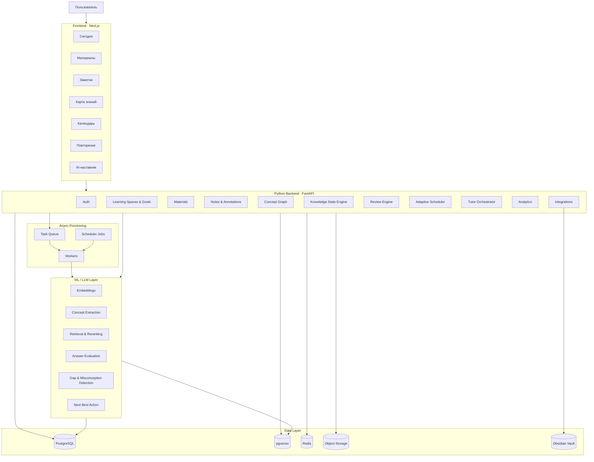
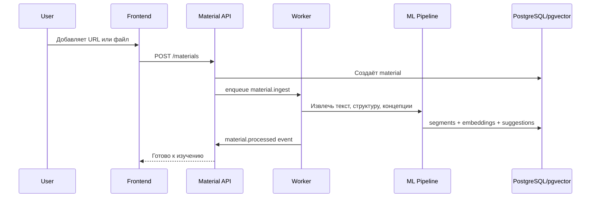
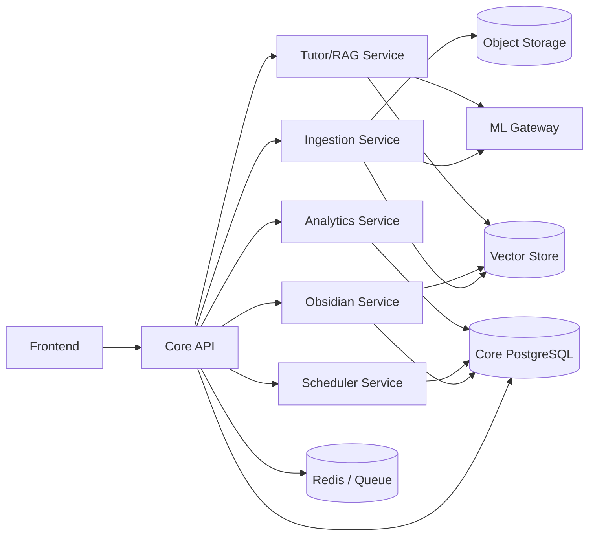

# Personal Learning OS — техническая архитектура и этапы разработки

> Документ описывает систему в двух измерениях:
>
> 1. **Вертикальные технические слои** — Frontend, Backend, ML/LLM, базы данных, фоновые процессы и инфраструктура.
> 2. **Сквозные продуктовые вертикали** — материалы, заметки, концепции, модель знаний, повторение, календарь, AI-наставник и аналитика.
>
> Главная задача архитектуры — показать не только из каких блоков состоит система, но и **как они соединяются в единый рабочий цикл обучения**.

---

# 1. Архитектурная стратегия

## 1.1. Не начинать с физических микросервисов

Хотя систему удобно проектировать как набор отдельных сервисов, первую версию рекомендуется реализовать как:

```text
Frontend
    ↓
Backend API — модульный монолит
    ├── Materials
    ├── Notes
    ├── Concepts
    ├── Knowledge State
    ├── Reviews
    ├── Calendar
    ├── Tutor
    └── Analytics
    ↓
PostgreSQL + pgvector + Redis + Object Storage
```

При этом каждый доменный модуль должен иметь:

- собственные модели;
- собственный application layer;
- собственные API endpoints;
- собственные события;
- ограниченный доступ к данным других модулей;
- ясную ответственность.

Такую систему позже можно разделить на физические микросервисы без полной переработки.

---

## 1.2. Почему модульный монолит лучше для MVP

Если сразу создавать отдельные сервисы для материалов, графа, календаря, RAG и повторений, появятся дополнительные задачи:

- service discovery;
- отдельная авторизация;
- сетевые ошибки;
- distributed tracing;
- версионирование контрактов;
- очереди;
- согласованность данных;
- deployment нескольких приложений;
- сложное локальное окружение.

На этапе, когда продуктовая логика ещё меняется, это замедлит разработку.

Поэтому предлагается:

### Этап 1

Логические сервисы внутри одного Python-приложения.

### Этап 2

Отдельные worker-процессы для тяжёлых задач.

### Этап 3

Вынос наиболее нагруженных и независимых модулей в отдельные сервисы.

---

## 1.3. Основные архитектурные принципы

1. **Domain-first** — структура системы строится вокруг учебных сущностей, а не вокруг библиотек.
2. **Event-driven внутри системы** — значимые действия публикуют события.
3. **PostgreSQL как источник истины**.
4. **pgvector для первого этапа semantic search**.
5. **ML не блокирует основной пользовательский сценарий**.
6. **Все тяжёлые операции выполняются асинхронно**.
7. **Каждый автоматический вывод хранит происхождение и confidence**.
8. **Obsidian по умолчанию используется в read-only режиме**.
9. **Пользовательские данные и AI-generated данные различаются**.
10. **Сервис должен быть self-hosted и подниматься через Docker Compose**.

---

# 2. Общая схема системы



---

# 3. Вертикальные технические блоки

---

# 3.1. Frontend

## 3.1.1. Рекомендуемый стек

```text
Next.js
React
TypeScript
Tailwind CSS
TanStack Query
Zustand
React Hook Form
Zod
Cytoscape.js или React Flow
FullCalendar
TipTap или Milkdown
```

---

## 3.1.2. Ответственность Frontend

Frontend отвечает за:

- отображение состояния системы;
- запуск учебных действий;
- создание заметок;
- работу с видеоматериалами;
- визуализацию графа;
- календарь;
- прохождение повторений;
- диалог с AI;
- optimistic UI;
- локальное состояние текущей сессии;
- real-time отображение фоновых задач.

Frontend **не должен** самостоятельно:

- рассчитывать mastery;
- выбирать следующее учебное действие;
- определять semantic similarity;
- вычислять интервалы повторения;
- изменять граф без backend-валидации.

---

## 3.1.3. Главные frontend-модули

```text
frontend/
├── app/
│   ├── today/
│   ├── spaces/
│   ├── materials/
│   ├── concepts/
│   ├── graph/
│   ├── calendar/
│   ├── reviews/
│   └── tutor/
├── features/
│   ├── learning-session/
│   ├── material-player/
│   ├── note-capture/
│   ├── concept-editor/
│   ├── graph-view/
│   ├── review-session/
│   └── tutor-chat/
├── entities/
│   ├── material/
│   ├── concept/
│   ├── note/
│   ├── learning-goal/
│   └── calendar-item/
└── shared/
    ├── api/
    ├── ui/
    ├── hooks/
    └── types/
```

---

## 3.1.4. Главные экраны

### Сегодня

Показывает:

- следующее действие;
- текущую цель;
- длительность;
- причину рекомендации;
- обязательные повторения;
- возможность сократить или перенести план.

### Learning Space

Показывает:

- цель;
- маршрут;
- состояние предмета;
- материалы;
- активные концепции;
- ближайшие действия.

### Материал

Показывает:

- видео, статью, PDF или notebook;
- структуру;
- таймкоды;
- заметки;
- связанные концепции;
- прогресс.

### Концепция

Показывает:

- описание;
- пользовательское объяснение;
- mastery;
- материалы;
- пробелы;
- связи;
- повторения;
- задачи.

### Карта

Показывает:

- концепции;
- связи;
- фильтры;
- глубину понимания;
- пробелы;
- межпредметные связи.

### Календарь

Показывает:

- лекции;
- практику;
- повторения;
- план и факт;
- предложенные переносы.

### Повторение

Показывает:

- вопрос;
- формат ответа;
- уверенность пользователя;
- feedback;
- ссылку на источник.

### AI-наставник

Показывает:

- диалог;
- выбранный режим;
- источники;
- связанные концепции;
- найденные пробелы;
- действия, которые можно сохранить.

---

# 3.2. Backend

## 3.2.1. Рекомендуемый стек

```text
Python 3.12+
FastAPI
Pydantic
SQLAlchemy 2
Alembic
PostgreSQL
pgvector
Redis
Dramatiq / Celery
APScheduler
httpx
pytest
```

---

## 3.2.2. Архитектурный стиль Backend

Каждый модуль имеет четыре слоя:

```text
API
↓
Application
↓
Domain
↓
Infrastructure
```

### API

- HTTP endpoints;
- WebSocket / SSE;
- schema validation;
- authentication;
- error mapping.

### Application

- use cases;
- orchestration;
- transactions;
- permissions;
- domain events.

### Domain

- entities;
- value objects;
- rules;
- state transitions;
- domain services.

### Infrastructure

- SQLAlchemy repositories;
- external APIs;
- file system;
- task queue;
- LLM providers;
- vector search.

---

## 3.2.3. Backend-модули

```text
backend/
├── app/
│   ├── auth/
│   ├── users/
│   ├── learning_spaces/
│   ├── learning_goals/
│   ├── materials/
│   ├── annotations/
│   ├── notes/
│   ├── concepts/
│   ├── knowledge_state/
│   ├── reviews/
│   ├── scheduler/
│   ├── tutor/
│   ├── analytics/
│   ├── integrations/
│   └── shared/
├── workers/
├── migrations/
├── tests/
└── main.py
```

---

## 3.2.4. Главные backend-компоненты

### Auth Service

Ответственность:

- пользователь;
- JWT или session auth;
- настройки;
- timezone;
- LLM provider settings;
- права доступа.

### Learning Space Service

Ответственность:

- пространства;
- цели;
- приоритеты;
- критерии завершения;
- связи между областями.

### Material Service

Ответственность:

- регистрация материалов;
- метаданные;
- статусы;
- структура;
- progression;
- сегменты;
- связь с курсами и целями.

### Annotation Service

Ответственность:

- таймкоды;
- выделения;
- цитаты;
- заметки;
- привязка к материалу;
- быстрый ввод.

### Concept Service

Ответственность:

- концепции;
- канонические названия;
- merge / split;
- relations;
- prerequisites;
- пользовательское подтверждение.

### Knowledge State Service

Ответственность:

- mastery;
- evidence;
- forgetting;
- gaps;
- misconceptions;
- пересчёт состояния.

### Review Service

Ответственность:

- вопросы;
- review queue;
- интервалы;
- ответы;
- feedback;
- типы уровней мышления.

### Scheduler Service

Ответственность:

- календарь;
- планирование;
- переносы;
- plan/fact;
- ограничения;
- приоритет действий.

### Tutor Service

Ответственность:

- chat sessions;
- retrieval;
- prompt orchestration;
- инструменты;
- сохранение выводов;
- ссылки на источники.

### Analytics Service

Ответственность:

- агрегации;
- временные ряды;
- рост знаний;
- эффективность материалов;
- план/факт;
- качество рекомендаций.

### Integration Service

Ответственность:

- Obsidian;
- YouTube;
- web pages;
- PDFs;
- Jupyter;
- GitHub;
- внешние календари.

---

# 3.3. ML / LLM

## 3.3.1. Общий принцип

ML-слой должен быть независим от конкретного LLM-провайдера.

Backend обращается не напрямую к OpenAI, локальной модели или другому API, а к интерфейсам:

```python
class EmbeddingProvider:
    async def embed(self, texts: list[str]) -> list[list[float]]:
        ...

class ChatProvider:
    async def complete(self, request: ChatRequest) -> ChatResponse:
        ...

class RerankerProvider:
    async def rerank(self, query: str, documents: list[str]) -> list[float]:
        ...
```

---

## 3.3.2. ML-компоненты MVP

### Embedding Service

Используется для:

- semantic search;
- сопоставления заметок и концепций;
- поиска дубликатов;
- RAG;
- рекомендации материалов;
- построения предполагаемых связей.

### Concept Extraction

Вход:

- транскрипт;
- статья;
- заметка;
- глава;
- пользовательское объяснение.

Выход:

- концепции;
- определения;
- prerequisites;
- связи;
- confidence;
- source spans.

### Note Classification

Классы:

- idea;
- definition;
- question;
- gap;
- hypothesis;
- example;
- application;
- contradiction;
- summary.

### Answer Evaluation

Оценивает:

- корректность;
- полноту;
- самостоятельность;
- уровень мышления;
- использование подсказок;
- уверенность;
- возможный misconception.

### Gap Detection

Определяет:

- отсутствующий prerequisite;
- противоречие;
- смешение концепций;
- поверхностное объяснение;
- неспособность применить.

### Retrieval Pipeline

```text
Query parsing
→ learning-space filter
→ concept filter
→ vector recall
→ BM25
→ metadata filters
→ reranking
→ diversity
→ context assembly
```

---

## 3.3.3. ML-компоненты будущих этапов

### Knowledge Tracing

Предсказывает вероятность успешного выполнения задания.

### Forgetting Prediction

Предсказывает, когда концепцию нужно вернуть.

### Next Best Learning Action

Выбирает:

- что изучать;
- в каком формате;
- сколько времени;
- на каком уровне мышления.

### Material Ranking

Ранжирует материалы для конкретного пробела.

### Learning Difficulty Model

Оценивает сложность материала для конкретного пользователя.

---

## 3.3.4. ML Registry

Для каждого AI-результата следует хранить:

```yaml
provider: local_qwen
model: qwen3
prompt_version: concept_extraction_v3
created_at: ...
input_hash: ...
confidence: 0.82
latency_ms: 1400
token_usage: ...
```

Это позволит:

- сравнивать модели;
- воспроизводить результаты;
- обновлять промпты;
- проводить offline evaluation.

---

# 3.4. База данных

## 3.4.1. Основная база

**PostgreSQL** является источником истины.

В ней хранятся:

- пользователи;
- пространства;
- материалы;
- концепции;
- заметки;
- отношения;
- события;
- задания;
- календарь;
- история mastery;
- AI metadata.

---

## 3.4.2. Vector storage

Для MVP:

```text
PostgreSQL + pgvector
```

Хранятся embeddings:

- material segments;
- notes;
- concepts;
- user explanations;
- tutor messages;
- tasks.

---

## 3.4.3. Redis

Используется для:

- очереди задач;
- кэша;
- distributed locks;
- short-lived session state;
- rate limits;
- progress фоновых задач.

---

## 3.4.4. Object Storage

Для self-hosted варианта:

- MinIO;
- локальная директория;
- S3-compatible storage.

Хранит:

- PDF;
- аудио;
- транскрипты;
- изображения;
- notebook;
- экспорт;
- backup;
- attachment.

---

## 3.4.5. Граф

Первоначально граф хранится в PostgreSQL:

```text
concepts
concept_relations
concept_relation_evidence
```

Отдельная graph database нужна только если:

- граф становится очень большим;
- нужны сложные traversal queries;
- появляются multi-user общие графы;
- PostgreSQL перестаёт справляться.

---

# 3.5. Background Workers

## 3.5.1. Что выполняется асинхронно

- скачивание и обработка материала;
- транскрипция;
- chunking;
- embeddings;
- concept extraction;
- индексация Obsidian;
- пересчёт knowledge state;
- генерация вопросов;
- RAG preprocessing;
- аналитические агрегации;
- адаптивное перепланирование;
- backup.

---

## 3.5.2. Очереди задач

Можно разделить:

```text
default
ingestion
embeddings
llm
scheduler
analytics
obsidian
```

---

## 3.5.3. Требования к задачам

Каждая задача должна быть:

- идемпотентной;
- повторяемой;
- версионированной;
- наблюдаемой;
- способной продолжить после сбоя;
- связанной с job record.

---

# 3.6. Инфраструктура

## 3.6.1. Docker Compose

```text
frontend
backend
worker
scheduler
postgres
redis
minio
optional-local-llm
reverse-proxy
```

---

## 3.6.2. Reverse Proxy

Возможные варианты:

- Caddy;
- Traefik;
- Nginx.

Ответственность:

- HTTPS;
- routing;
- compression;
- access logs;
- WebSocket proxy.

---

## 3.6.3. Наблюдаемость

Минимум:

- structured logs;
- Sentry;
- health checks;
- task dashboard;
- metrics endpoint.

Позже:

- Prometheus;
- Grafana;
- OpenTelemetry;
- Loki.

---

# 4. Сквозные продуктовые вертикали

Ниже каждая вертикаль описывается как полный путь:

```text
Frontend
→ Backend
→ ML
→ Database
→ Events
→ результат для пользователя
```

---

# 4.1. Вертикаль «Добавление и обработка материала»

## Цель

Пользователь добавляет курс, видео, статью, PDF, notebook или ссылку, после чего материал становится структурированной частью системы.

## Поток



## Frontend

- форма добавления;
- статус processing;
- просмотр структуры;
- подтверждение metadata;
- выбор Learning Space.

## Backend

- validation;
- тип источника;
- хранение origin;
- создание ingestion job;
- статусы.

## ML

- text extraction;
- chunking;
- embeddings;
- concept suggestion;
- difficulty estimate.

## Database

- materials;
- material_segments;
- ingestion_jobs;
- embeddings;
- concept_suggestions.

## События

```text
material.created
material.ingestion_started
material.segmented
material.embedded
material.processed
material.failed
```

---

# 4.2. Вертикаль «Учебная сессия и заметка»

## Цель

Пользователь изучает материал и сохраняет значимую мысль с минимальным трением.

## Поток

```text
Открыть материал
→ начать session
→ создать заметку
→ автоматически сохранить контекст
→ предложить тип заметки
→ предложить концепцию
→ обновить activity history
```

## Frontend

- player или reader;
- hotkey;
- mini note composer;
- таймкод;
- session timer;
- resume.

## Backend

- learning session;
- note creation;
- segment relation;
- activity logging;
- domain event.

## ML

- note type classification;
- concept matching;
- duplicate detection;
- optional rewrite suggestion.

## Database

- learning_sessions;
- notes;
- annotations;
- note_concept_links;
- activities.

## События

```text
session.started
note.created
note.linked_to_concept
session.completed
```

---

# 4.3. Вертикаль «Obsidian sync»

## Цель

Использовать существующие заметки пользователя как часть системы без разрушения vault.

## Поток

```text
Vault scan
→ changed files
→ Markdown parsing
→ frontmatter + wikilinks
→ chunking
→ embeddings
→ concept matching
→ пользователь подтверждает связи
```

## Frontend

- настройка vault;
- статус sync;
- найденные заметки;
- предложения связей;
- конфликты.

## Backend

- file registry;
- checksum;
- sync state;
- diff;
- permissions;
- conflict handling.

## ML

- concept matching;
- semantic deduplication;
- note classification;
- relation suggestions.

## Database

- external_documents;
- sync_runs;
- source_mappings;
- concept_suggestions;
- file_hashes.

## События

```text
obsidian.sync_started
obsidian.file_added
obsidian.file_changed
obsidian.file_removed
obsidian.sync_completed
```

---

# 4.4. Вертикаль «Концепция и граф»

## Цель

Превращать материалы и заметки в развивающуюся карту понимания.

## Поток

```text
Concept suggestion
→ подтверждение
→ создание узла
→ поиск связей
→ подтверждение relations
→ отображение на карте
```

## Frontend

- concept editor;
- merge/split;
- graph;
- relation confirmation;
- filters.

## Backend

- concept lifecycle;
- canonicalization;
- relation rules;
- provenance;
- graph queries.

## ML

- entity/concept extraction;
- relation prediction;
- similarity;
- duplicate detection.

## Database

- concepts;
- concept_aliases;
- concept_relations;
- relation_evidence;
- concept_sources.

## События

```text
concept.created
concept.merged
concept.relation_added
concept.relation_confirmed
concept.updated
```

---

# 4.5. Вертикаль «Модель состояния знаний»

## Цель

Оценивать не наличие заметки, а степень понимания.

## Поток

```text
Learning activity
→ evidence
→ scoring
→ mastery update
→ gap detection
→ recommendation
```

## Frontend

- mastery visualization;
- evidence history;
- gaps;
- explanation of score.

## Backend

- evidence normalization;
- scoring rules;
- confidence;
- state history;
- decay.

## ML

- answer quality;
- misconception detection;
- future knowledge tracing.

## Database

- concept_evidence;
- concept_state;
- concept_state_history;
- misconceptions;
- knowledge_gaps.

## События

```text
evidence.created
knowledge_state.recalculation_requested
knowledge_state.updated
gap.detected
misconception.detected
```

---

# 4.6. Вертикаль «Повторение и проверка»

## Цель

Возвращать концепцию в подходящий момент и на подходящем уровне мышления.

## Поток

```text
Knowledge state
→ review due
→ select review type
→ question
→ answer
→ evaluation
→ feedback
→ state update
→ next interval
```

## Frontend

- review queue;
- response editor;
- confidence selector;
- feedback;
- source view.

## Backend

- review generation;
- scheduling;
- answer storage;
- interval calculation;
- retry strategy.

## ML

- question generation;
- answer evaluation;
- misconception detection;
- difficulty calibration.

## Database

- review_items;
- review_attempts;
- prompts;
- evaluations;
- schedule.

## События

```text
review.created
review.started
review.answered
review.evaluated
review.rescheduled
```

---

# 4.7. Вертикаль «Адаптивный календарь»

## Цель

Планировать обучение и перестраивать его по фактическому поведению.

## Поток

```text
Goals + available time + reviews + gaps
→ candidate activities
→ priority calculation
→ calendar plan
→ actual session
→ plan/fact
→ rescheduling
```

## Frontend

- calendar;
- drag and drop;
- fixed/flexible marker;
- accept suggestion;
- daily load.

## Backend

- constraints;
- priorities;
- schedule generation;
- conflict resolution;
- rescheduling.

## ML

На первом этапе:

- heuristics.

Позже:

- duration prediction;
- expected gain;
- next best action.

## Database

- calendar_items;
- schedule_versions;
- availability;
- planning_constraints;
- actual_activity.

## События

```text
schedule.generated
calendar_item.moved
activity.overdue
schedule.recalculation_requested
schedule.updated
```

---

# 4.8. Вертикаль «AI-наставник»

## Цель

Вести контекстный диалог о предмете и помогать мыслить, а не только отвечать.

## Поток

```text
User message
→ determine tutor mode
→ retrieve relevant context
→ assemble prompt
→ LLM
→ citations
→ optional actions
```

## Frontend

- chat;
- mode selection;
- source panel;
- save as note;
- create gap;
- create review;
- link concept.

## Backend

- tutor session;
- context policy;
- retrieval orchestration;
- tool calls;
- safety;
- action confirmation.

## ML

- query understanding;
- retrieval;
- reranking;
- answer generation;
- question generation;
- answer evaluation.

## Database

- tutor_sessions;
- tutor_messages;
- retrieved_context;
- tutor_actions;
- prompt_versions.

## События

```text
tutor.message_created
tutor.response_generated
tutor.gap_suggested
tutor.review_suggested
tutor.note_saved
```

---

# 4.9. Вертикаль «Экран Сегодня»

## Цель

Собрать результаты всех подсистем в один понятный следующий шаг.

## Данные приходят из:

- целей;
- календаря;
- review queue;
- gaps;
- learning path;
- knowledge state;
- доступного времени.

## Backend orchestration

```text
Today Service
├── Scheduler
├── Review Service
├── Knowledge State
├── Learning Goals
└── Materials
```

## Результат

```json
{
  "available_minutes": 55,
  "primary_action": {
    "type": "material_session",
    "material_id": "...",
    "duration": 25,
    "reason": "Это prerequisite для текущей темы"
  },
  "reviews": [],
  "optional_actions": [],
  "fallback_plan": {}
}
```

---

# 4.10. Вертикаль «Аналитика роста»

## Цель

Показывать изменение понимания, а не только активность.

## Frontend

- growth timeline;
- concept transitions;
- retention;
- gaps closed;
- capabilities;
- plan/fact.

## Backend

- aggregations;
- snapshots;
- cohort-like analysis одного пользователя;
- material effectiveness.

## ML

Позже:

- causal estimates;
- recommendation evaluation;
- predicted vs actual learning gain.

## Database

- analytics_snapshots;
- daily_metrics;
- recommendation_outcomes;
- state transitions.

---

# 5. Матрица пересечения технических слоёв и продуктовых вертикалей

| Продуктовая вертикаль | Frontend | Backend | ML/LLM | PostgreSQL | pgvector | Workers |
|---|---|---|---|---|---|---|
| Материалы | загрузка и просмотр | Material Service | extraction, chunking | материалы и сегменты | embeddings | ingestion |
| Заметки | быстрый ввод | Annotation Service | классификация | notes | note embeddings | optional |
| Obsidian | sync UI | Integration Service | concept matching | mappings | embeddings | indexing |
| Концепции | editor и graph | Concept Service | extraction, relations | graph tables | similarity | extraction |
| Knowledge State | mastery UI | Knowledge Engine | evaluation | state/evidence | optional | recalculation |
| Повторение | review UI | Review Service | generation/evaluation | attempts | retrieval | question generation |
| Календарь | calendar UI | Scheduler | future ranking | schedule | — | recalculation |
| Tutor | chat | Tutor Orchestrator | RAG/LLM | sessions | retrieval | long jobs |
| Сегодня | dashboard | Today Orchestrator | optional ranking | read models | optional | daily preparation |
| Аналитика | charts | Analytics | future models | snapshots | — | aggregation |

---

# 6. Пересечения между доменными сервисами

---

## 6.1. Material Service ↔ Concept Service

Материал предоставляет:

- segments;
- metadata;
- extracted terms;
- source references.

Concept Service возвращает:

- связанные concepts;
- concept coverage;
- prerequisites;
- suggested relations.

---

## 6.2. Concept Service ↔ Knowledge State

Concept Service отвечает за:

- что представляет собой концепция;
- как она связана с другими.

Knowledge State отвечает за:

- насколько пользователь её понимает.

---

## 6.3. Knowledge State ↔ Review Service

Knowledge State предоставляет:

- слабые уровни;
- forgetting risk;
- gaps;
- confidence.

Review Service возвращает:

- answers;
- scores;
- evidence;
- updated intervals.

---

## 6.4. Review Service ↔ Scheduler

Review Service сообщает:

- что необходимо повторить;
- дедлайн;
- ожидаемую длительность;
- важность.

Scheduler размещает это в календаре.

---

## 6.5. Scheduler ↔ Today Service

Scheduler формирует допустимые действия.

Today Service выбирает короткий набор действий на текущий день.

---

## 6.6. Tutor ↔ Все сервисы

Tutor читает данные из:

- Materials;
- Notes;
- Concepts;
- Knowledge State;
- Reviews;
- Scheduler.

Но записывает изменения через публичные use cases:

- CreateNote;
- SuggestGap;
- CreateReview;
- LinkConcept;
- AddMaterial.

Tutor не должен напрямую изменять таблицы других модулей.

---

# 7. Событийная архитектура

## 7.1. Зачем события

События позволяют не связывать модули напрямую.

Пример:

```text
review.answered
```

На него могут реагировать:

- Knowledge State;
- Scheduler;
- Analytics;
- Tutor context builder.

---

## 7.2. Domain events

```text
material.created
material.processed

note.created

concept.created
concept.relation_added

learning_activity.completed

review.answered
review.evaluated

knowledge_state.updated
gap.detected

schedule.updated

obsidian.file_changed
```

---

## 7.3. Реализация для MVP

Для начала:

```text
outbox_events table
+ worker polling
```

Это надёжнее, чем сразу поднимать Kafka.

Позже:

- Redis Streams;
- RabbitMQ;
- NATS;
- Kafka.

---

# 8. Контракты API

## 8.1. Пример REST API

```text
POST   /api/v1/learning-spaces
GET    /api/v1/learning-spaces/{id}

POST   /api/v1/materials
GET    /api/v1/materials/{id}
POST   /api/v1/materials/{id}/sessions

POST   /api/v1/notes
PATCH  /api/v1/notes/{id}

POST   /api/v1/concepts
POST   /api/v1/concepts/{id}/relations
GET    /api/v1/concepts/{id}/state

GET    /api/v1/reviews/due
POST   /api/v1/reviews/{id}/attempts

GET    /api/v1/calendar
POST   /api/v1/calendar/recalculate

GET    /api/v1/today
POST   /api/v1/tutor/messages

POST   /api/v1/integrations/obsidian/sync
```

---

## 8.2. WebSocket / SSE

Нужны для:

- progress ingestion;
- LLM streaming;
- background job state;
- live sync;
- calendar recalculation.

---

# 9. Репозиторий

```text
personal-learning-os/
├── apps/
│   ├── backend/
│   ├── frontend/
│   └── worker/
├── packages/
│   ├── contracts/
│   ├── prompts/
│   └── shared-types/
├── infrastructure/
│   ├── docker/
│   ├── nginx/
│   └── monitoring/
├── docs/
│   ├── product.md
│   ├── architecture.md
│   ├── data-model.md
│   └── adr/
├── scripts/
├── docker-compose.yml
├── .env.example
└── README.md
```

---

# 10. Поэтапный план разработки

---

# Этап 0. Архитектурный фундамент

## Цель

Создать каркас, в который можно последовательно добавлять продуктовые вертикали.

## Backend

- FastAPI project;
- config;
- dependency injection;
- SQLAlchemy;
- Alembic;
- auth;
- error format;
- health checks;
- logging;
- outbox events.

## Frontend

- Next.js;
- routing;
- layout;
- auth;
- API client;
- design tokens;
- базовые UI-компоненты.

## Database

- users;
- learning_spaces;
- learning_goals;
- outbox_events;
- jobs.

## Infrastructure

- Docker Compose;
- PostgreSQL;
- Redis;
- MinIO;
- backend;
- frontend;
- worker.

## Результат

Пользователь может:

- войти;
- создать Learning Space;
- задать цель;
- открыть пустой экран пространства.

---

# Этап 1. Первая сквозная вертикаль: материал → сессия → заметка

## Цель

Получить первый реально используемый учебный сценарий.

## Backend

- Material Service;
- Learning Session Service;
- Annotation Service;
- activity log;
- ingestion jobs.

## Frontend

- добавление ссылки;
- список материалов;
- material page;
- start/stop session;
- note with timestamp.

## ML

- metadata extraction;
- optional transcript;
- simple embeddings.

## Database

- materials;
- material_segments;
- learning_sessions;
- notes;
- activities.

## Результат

Пользователь может:

1. добавить видео;
2. открыть его;
3. начать сессию;
4. создать заметку на таймкоде;
5. завершить сессию.

---

# Этап 2. Концепции и карта

## Цель

Перестать хранить только заметки и начать строить предметную модель.

## Backend

- Concept Service;
- aliases;
- relations;
- concept-note links;
- merge/split.

## Frontend

- concept page;
- concept selector;
- graph;
- relation editor.

## ML

- concept extraction;
- semantic concept matching;
- relation suggestions.

## Database

- concepts;
- aliases;
- relations;
- evidence;
- suggestions.

## Результат

Заметка может быть связана с концепцией, а концепции отображаются на карте.

---

# Этап 3. Obsidian

## Цель

Подключить существующую личную базу знаний.

## Backend

- vault registry;
- file watcher;
- parser;
- sync runs;
- conflict model.

## Frontend

- integration settings;
- sync status;
- suggestions;
- file source links.

## ML

- note classification;
- concept matching;
- duplicate suggestions.

## Database

- external_documents;
- file hashes;
- source mappings;
- sync jobs.

## Результат

Система читает Obsidian vault и использует заметки в карте и поиске.

---

# Этап 4. Knowledge State

## Цель

Начать моделировать понимание.

## Backend

- evidence model;
- scoring engine;
- state history;
- gaps;
- misconceptions;
- decay rules.

## Frontend

- mastery indicators;
- evidence timeline;
- gaps panel;
- confidence explanation.

## ML

- rule-based first;
- LLM answer evaluation;
- misconception extraction.

## Database

- concept_evidence;
- concept_state;
- state_history;
- gaps;
- misconceptions.

## Результат

У каждой концепции появляется многомерное состояние понимания.

---

# Этап 5. Повторение

## Цель

Возвращать пользователя к концепциям.

## Backend

- Review Service;
- review queue;
- intervals;
- attempts;
- answer evaluation.

## Frontend

- review session;
- different task types;
- confidence input;
- feedback.

## ML

- six-level question generation;
- answer evaluation;
- difficulty estimate.

## Database

- review_items;
- attempts;
- evaluations;
- schedules.

## Результат

Система создаёт повторения и обновляет knowledge state по ответам.

---

# Этап 6. Календарь и экран «Сегодня»

## Цель

Превратить набор функций в ежедневный учебный процесс.

## Backend

- Scheduler;
- Today Orchestrator;
- plan/fact;
- flexible/fixed blocks;
- recalculation.

## Frontend

- calendar;
- today screen;
- drag and drop;
- accept reschedule;
- short session mode.

## ML

- heuristic priority;
- duration estimate from history.

## Database

- calendar_items;
- schedule_versions;
- availability;
- planning constraints.

## Результат

Система показывает, что делать сегодня, и перестраивает план при изменениях.

---

# Этап 7. AI-наставник

## Цель

Создать диалоговый слой поверх всей системы.

## Backend

- Tutor Orchestrator;
- session context;
- retrieval;
- tools;
- action confirmation.

## Frontend

- chat;
- source panel;
- tutor modes;
- save action.

## ML

- RAG;
- reranking;
- Socratic mode;
- evaluation mode;
- gap detection.

## Database

- sessions;
- messages;
- retrieved context;
- actions;
- prompt versions.

## Результат

AI знает материалы, заметки, концепции, пробелы и календарь.

---

# Этап 8. Адаптивное перепланирование

## Цель

Сделать календарь чувствительным к фактическому поведению.

## Backend

- event-driven rescheduling;
- overrun handling;
- skipped activity policy;
- backlog limits;
- priority recalculation.

## Frontend

- объяснение изменений;
- comparison before/after;
- manual overrides.

## ML

- predicted duration;
- expected learning gain;
- workload estimation.

## Результат

План автоматически сдвигается без накопления бесконечного долга.

---

# Этап 9. Собственная ML-персонализация

## Цель

Перейти от эвристик к моделям.

## Data

Собираются:

- activities;
- answers;
- timing;
- confidence;
- outcomes;
- schedule decisions;
- material effectiveness;
- state transitions.

## Baselines

- logistic regression;
- CatBoost;
- simple knowledge tracing;
- learning-to-rank.

## Модели

- forgetting risk;
- question success;
- next best action;
- duration prediction;
- material ranking.

## Результат

Система начинает предсказывать, какое действие даст лучший прирост понимания.

---

# 11. Рекомендуемый порядок физических микросервисов

Не все логические модули следует выносить сразу.

## Оставить в основном Backend дольше

- Auth;
- Learning Spaces;
- Goals;
- Notes;
- Concepts;
- Knowledge State;
- Reviews;
- Calendar.

## Выносить первыми

### Ingestion Worker

Причина:

- тяжёлые файлы;
- отдельные зависимости;
- CPU/RAM нагрузка;
- нестабильные источники.

### ML Gateway

Причина:

- разные модели;
- GPU;
- batching;
- отдельное масштабирование.

### Obsidian Indexer

Причина:

- filesystem access;
- file watching;
- отдельный lifecycle.

### Tutor / RAG Service

Причина:

- streaming;
- сложная orchestration;
- высокая стоимость;
- отдельные лимиты.

### Analytics Worker

Причина:

- тяжёлые агрегации;
- не должен блокировать API.

---

# 12. Будущая физическая микросервисная схема



---

# 13. Владение данными

Даже внутри модульного монолита важно заранее определить ownership.

| Данные | Владелец |
|---|---|
| learning_spaces | Learning Space Service |
| materials | Material Service |
| notes | Annotation Service |
| concepts | Concept Service |
| concept_state | Knowledge State |
| review_items | Review Service |
| calendar_items | Scheduler |
| tutor_messages | Tutor Service |
| sync_runs | Integration Service |

Другие модули читают данные через:

- application service;
- repository interface;
- read model;
- event projection.

---

# 14. Read Models

Для сложных экранов лучше создавать отдельные read models.

## TodayReadModel

Объединяет:

- schedule;
- reviews;
- goals;
- gaps;
- recommendations.

## ConceptDetailReadModel

Объединяет:

- concept;
- state;
- notes;
- materials;
- relations;
- reviews;
- gaps.

## LearningSpaceOverview

Объединяет:

- goals;
- materials;
- concept growth;
- calendar;
- activity.

Это уменьшает количество frontend-запросов.

---

# 15. Тестирование

## Backend

- unit tests domain rules;
- integration tests repositories;
- API tests;
- event tests;
- migrations tests.

## Frontend

- component tests;
- interaction tests;
- Playwright end-to-end.

## ML

- golden datasets;
- prompt regression;
- retrieval metrics;
- evaluation agreement;
- hallucination checks.

## Critical end-to-end tests

1. Добавить материал.
2. Дождаться обработки.
3. Начать сессию.
4. Создать заметку.
5. Привязать концепцию.
6. Создать review.
7. Ответить.
8. Обновить mastery.
9. Перестроить календарь.
10. Увидеть новое действие на экране «Сегодня».

---

# 16. Минимальная техническая версия первого релиза

```text
Frontend:
- Next.js
- Today
- Materials
- Concept page
- Calendar
- Review
- Tutor

Backend:
- FastAPI modular monolith
- SQLAlchemy
- Alembic
- REST + SSE
- Outbox events

Data:
- PostgreSQL
- pgvector
- Redis
- MinIO

Workers:
- Dramatiq
- ingestion
- embeddings
- LLM
- scheduler

ML:
- embedding provider
- chat provider
- concept extraction
- answer evaluation
- RAG

Integration:
- Obsidian read-only
- URL
- YouTube transcript
- PDF

Infrastructure:
- Docker Compose
- Caddy
- backup
- logs
```

---

# 17. Главная сквозная вертикаль MVP

Первая версия должна поддерживать полный цикл:

```mermaid
flowchart LR
    A[Добавить материал]
    B[Открыть учебную сессию]
    C[Создать заметку]
    D[Связать с концепцией]
    E[Объяснить концепцию]
    F[Получить вопрос]
    G[Ответить]
    H[Обновить модель знаний]
    I[Запланировать следующее действие]
    J[Показать на экране Сегодня]

    A --> B --> C --> D --> E --> F --> G --> H --> I --> J
```



Если эта вертикаль работает, система уже является Personal Learning OS, даже если остальные функции ещё простые.

Если она не работает, отдельные красивые модули не создают целостного продукта.

---

# 18. Критерии готовности архитектуры

Архитектура считается пригодной, если:

- можно добавить новый тип материала без переписывания системы;
- можно заменить LLM-провайдера;
- можно изменить scoring mastery;
- можно добавить новый тип review;
- можно заменить scheduler;
- Obsidian не связан напрямую с UI;
- Tutor не изменяет чужие таблицы напрямую;
- тяжёлые операции не блокируют API;
- каждое автоматическое решение имеет provenance;
- можно восстановить состояние из событий и данных;
- можно постепенно выделять сервисы;
- пользовательский сценарий работает локально через Docker Compose.

---

# 19. Итог

Система строится одновременно:

## По вертикали технических слоёв

```text
Frontend
Backend
ML / LLM
Database
Workers
Infrastructure
```

## По горизонтали продуктовых вертикалей

```text
Материал
Заметка
Концепция
Knowledge State
Повторение
Календарь
AI-наставник
Аналитика
```

Каждая продуктовая вертикаль должна проходить через все необходимые технические слои.

Главная архитектурная единица разработки — не отдельный backend-модуль и не отдельный экран, а **полный пользовательский поток от действия до изменения модели знаний**.

Поэтому систему лучше развивать не так:

```text
сначала весь backend
→ затем весь frontend
→ затем весь ML
```

А так:

```text
одна сквозная вертикаль
→ backend
→ database
→ frontend
→ ML
→ события
→ тест
→ реальное использование
```

Первой такой вертикалью должна стать:

> **материал → учебная сессия → заметка → концепция → проверка → обновление понимания → следующее действие**.
